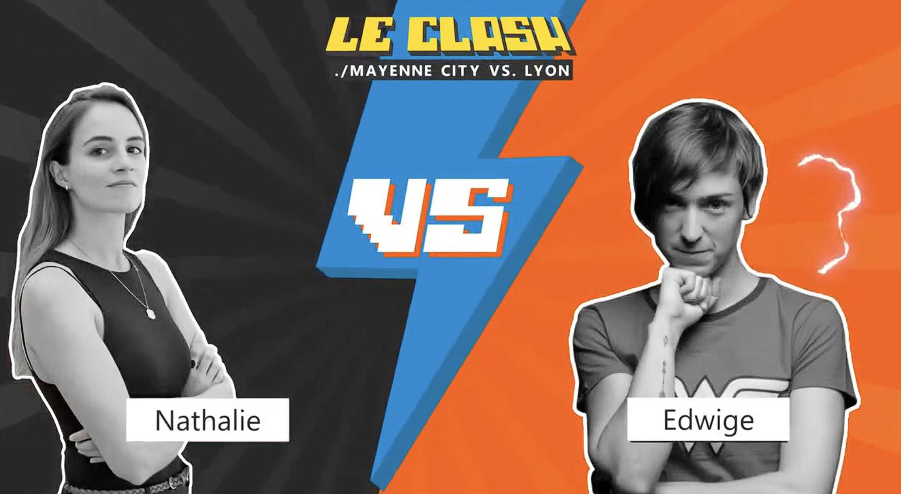

---
date:
    created: 2021-10-01
    updated: 2021-10-01
draft: false
authors: 
    - nathalie
categories: ["AI"]
readtime: 5
slug: clash-microsoft-ia-scratch-vs-etagere
tags: 
    - Microsoft
    - Build vs Buy
    - Strategy
    - YouTube
---

# Le Clash Microsoft - IA: From scratch vs. sur étagère

:boxing_glove:

Build from scratch or buy off-the-shelf? It's the ultimate AI showdown.

In this 'Clash' episode, we throw down over the pros, cons, and hidden traps of custom AI versus out-of-the-box Microsoft solutions. I don't pull punches—I'll give you the straight talk you need to make the right architectural call for your business.

Ring the bell, let's go.

👉 Watch the clash: [YouTube Video](https://www.youtube.com/watch?v=tNak1SiVe4c&list=PL5Kprdw8GhxfuvGtkGyhZ-o9AjfPxgoGw&index=6) | [LinkedIn Post](https://www.linkedin.com/posts/nathalie-fouet_leclash-data-bigdata-activity-6856168138753531904-YxLT)

<!-- more -->

