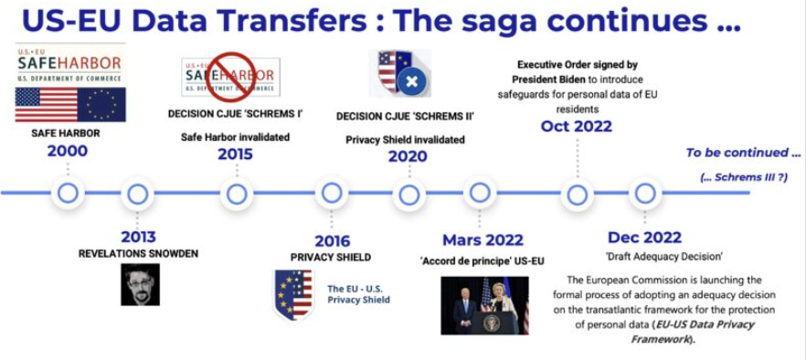

---
date:
    created: 2022-12-01
    updated: 2022-12-01
draft: false
authors: 
    - nathalie
categories: ["Data Platforms"]
readtime: 5
slug: us-eu-data-transfers-saga-continues
tags: 
    - Data Privacy
    - US-EU
    - Compliance
---

# US-EU Data Transfers: The Saga Continues

:earth_africa:

The US-EU data transfer saga is the soap opera that never ends, but your compliance strategy can't run on drama.

I've broken down the latest twists, what it means for your transatlantic data flows, and how to keep your operations running smoothly while the regulators figure things out. No legal jargon—just clear, actionable intelligence.

Let's keep your data moving safely.

👉 Read my take on the latest update: [LinkedIn Post](https://www.linkedin.com/feed/update/urn:li:activity:7009046997714223104)

<!-- more -->

