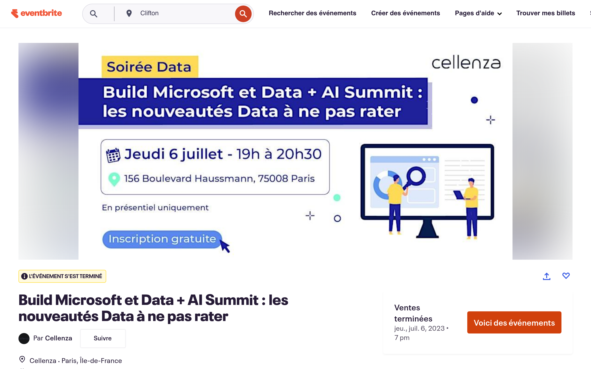

---
date:
    created: 2023-06-01
    updated: 2023-06-01
draft: false
authors: 
    - nathalie
categories: ["Data Platforms"]
readtime: 5
slug: analyse-annonces-data-fabric-databricks
tags: 
    - Microsoft Fabric
    - Databricks
    - Data Architecture
    - Meetup
---

# Analyse des Annonces Data: Microsoft Fabric & Databricks

:rocket:

The data landscape is shifting fast, and if you blink, you'll miss the revolution.

I recently broke down the massive announcements from Microsoft Build (hello, Microsoft Fabric!) and the Databricks Data + AI Summit. No marketing fluff—just the hardcore technical implications and what this means for your data architecture.

Ready to level up your platform? Let's decode the hype together.

👉 Catch the insights from the Meetup: [Eventbrite Link](https://www.eventbrite.fr/e/billets-build-microsoft-et-data-ai-summit-les-nouveautes-data-a-ne-pas-rater-656554541307) | [LinkedIn Post](https://www.linkedin.com/in/nathalie-fouet/recent-activity/all/)

<!-- more -->

