---
date:
    created: 2026-01-01
    updated: 2026-01-01
draft: false
authors: 
    - nathalie
categories: [Cyber]
readtime: 15
slug: cyber-trends-2025-2026
tags: 
    - Cyber
    - Phishing
    - Deepfakes
    - ANSSI
    - France
---

# Cyber Trends 2025-2026

:shield:

Cyber threats don’t wait — and frankly, neither should you.

I've just put together a deep dive into the cybersecurity trends defining 2025-2026. If you're looking for another generic, fear-mongering report, this isn't it. 

We’re talking actionable intel: real stats, a France-specific breakdown straight from ANSSI’s latest data, and a no-BS look at why AI-turbocharged phishing and deepfakes are still the sharpest weapons pointed at your organization.

Here's the deal: I don't just point out the problems; I build the defenses. In this breakdown, I'll walk you through exactly what you need to do to lock things down—starting tomorrow. 

Whether you’re a tech pro building secure infrastructure or just taking your own digital hygiene seriously, I've got you covered.

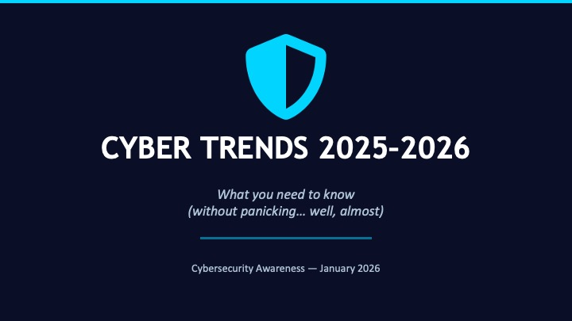

👉 Dig into the full breakdown below. Let's make the bad guys work for it.

<!-- more -->

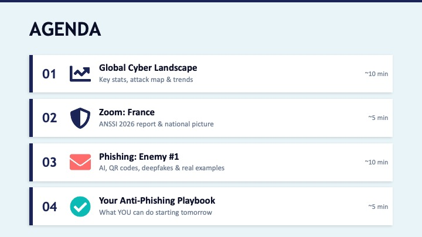

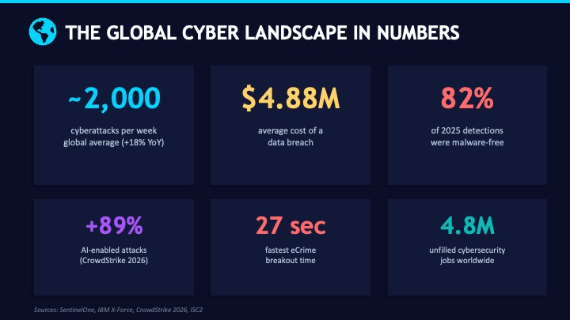

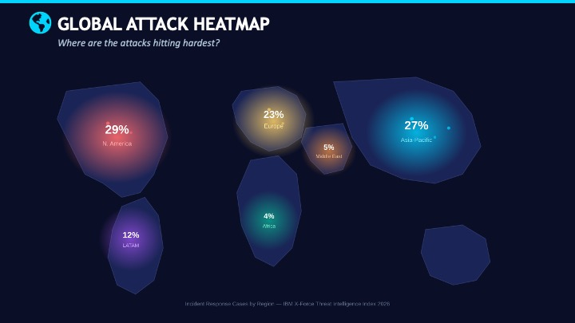

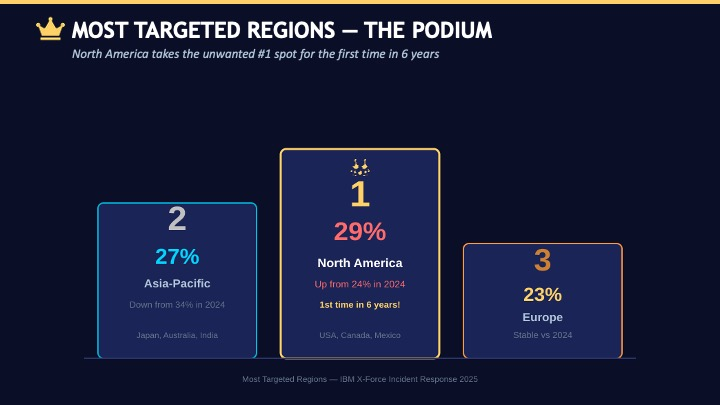

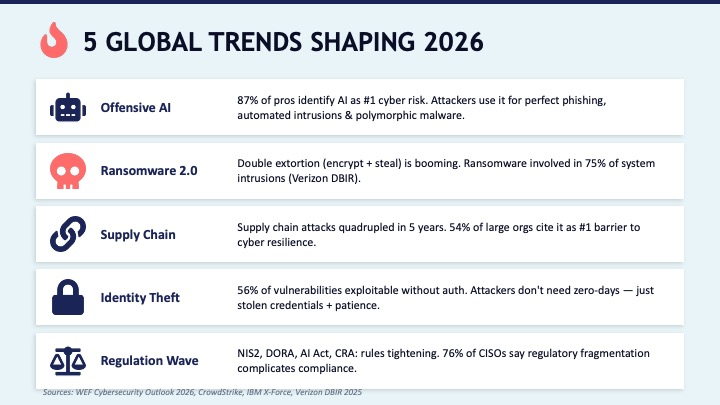

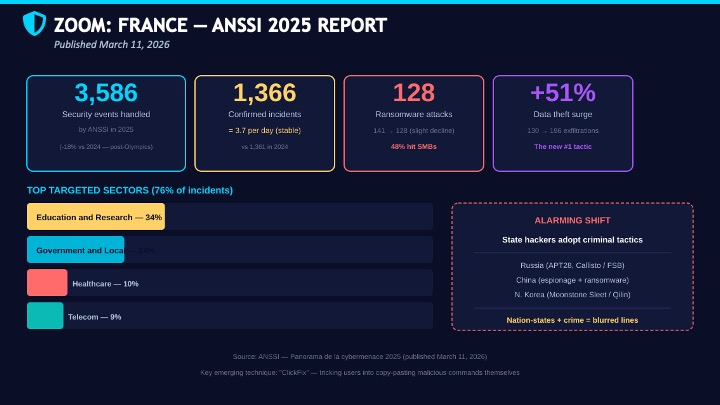

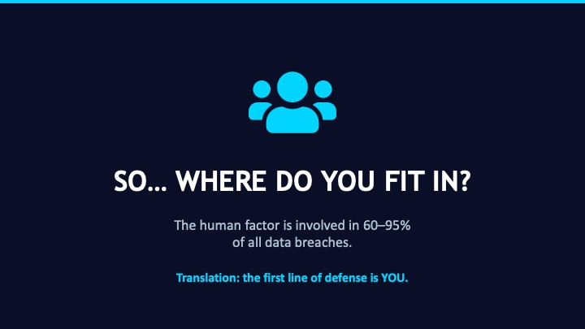

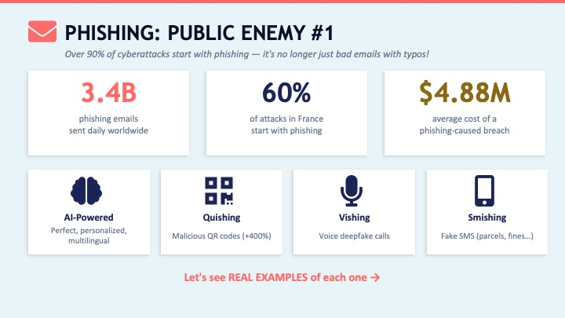

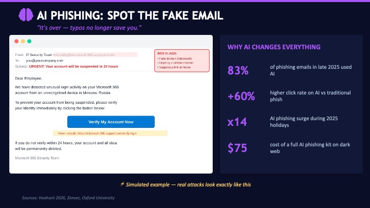

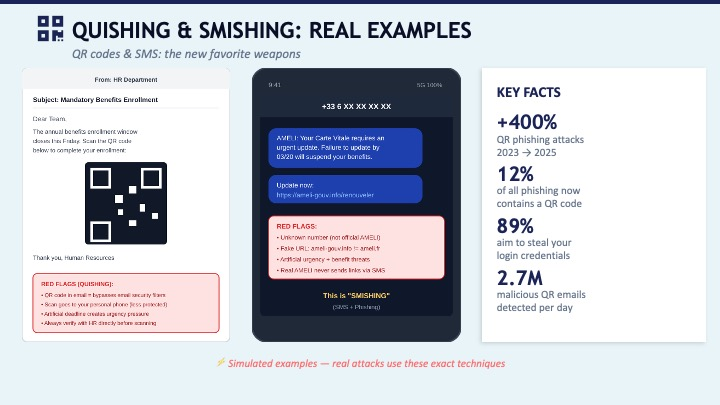

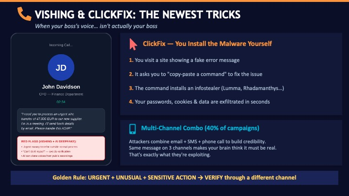

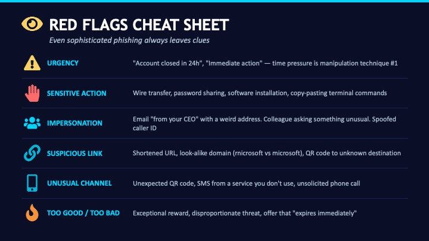

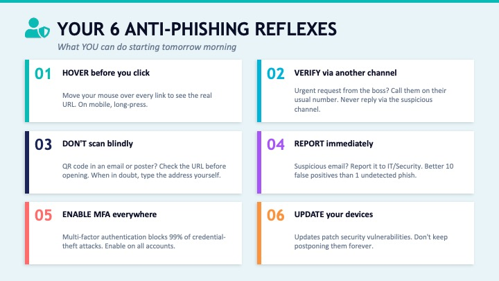

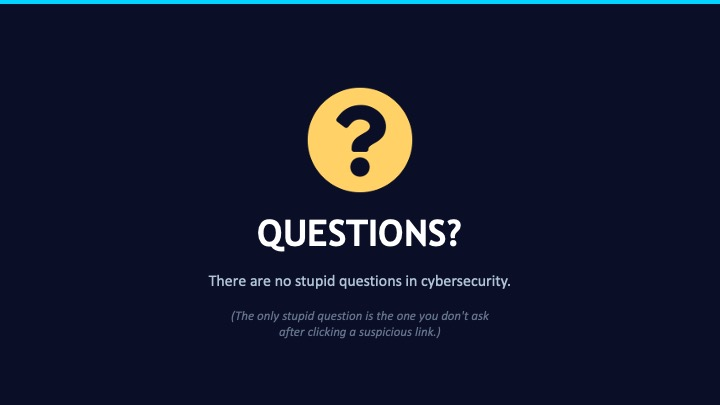

